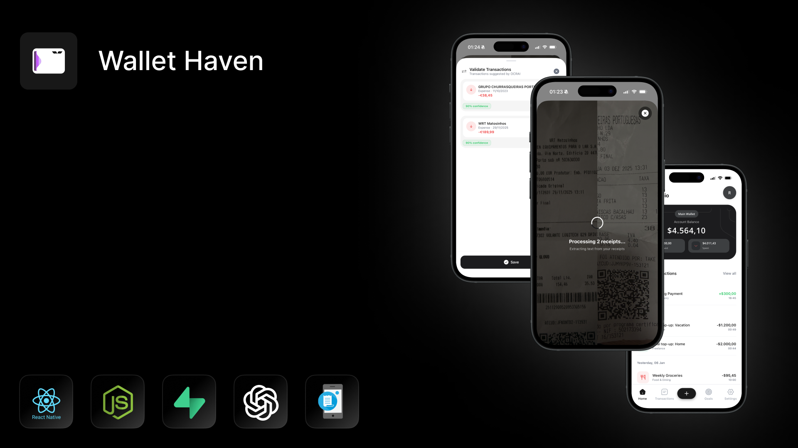
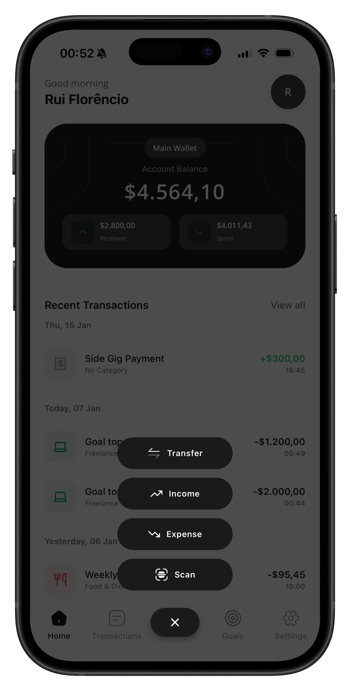
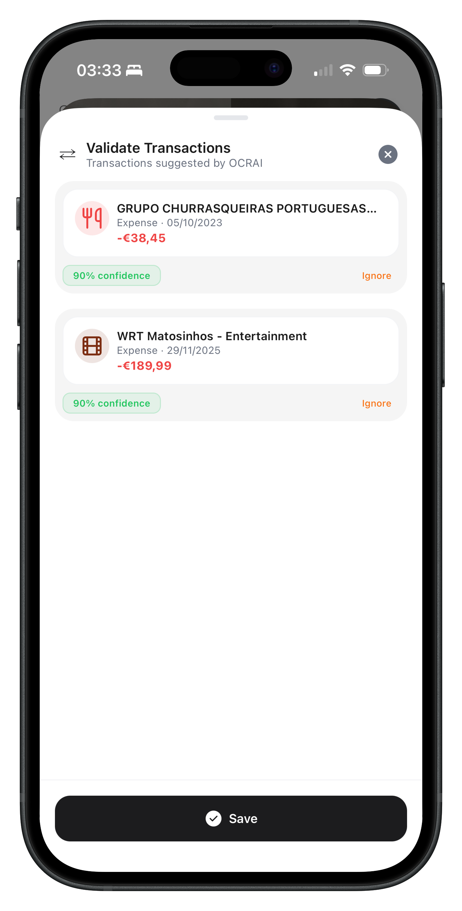
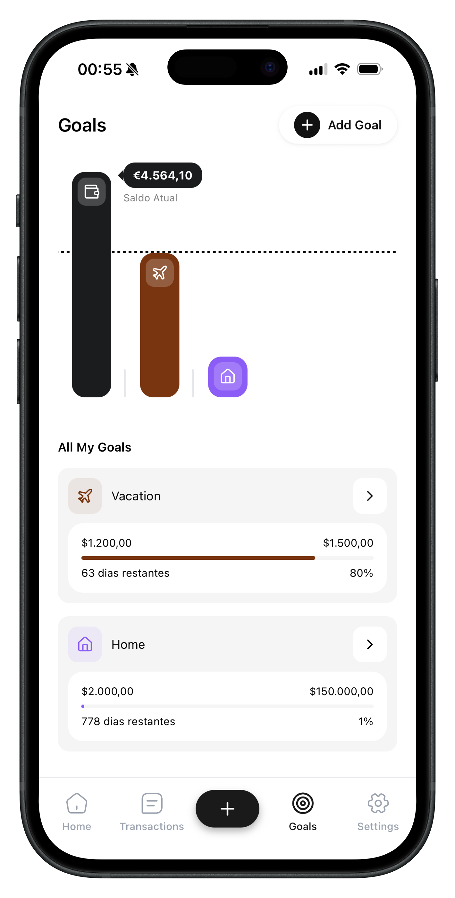
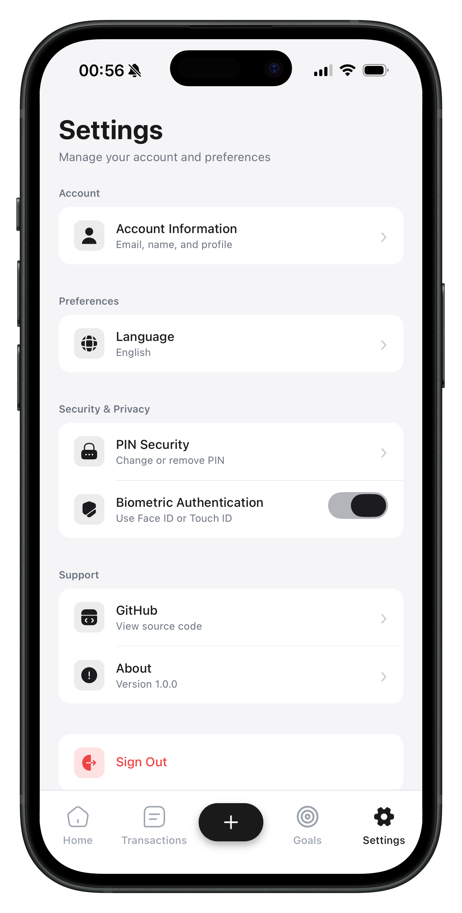
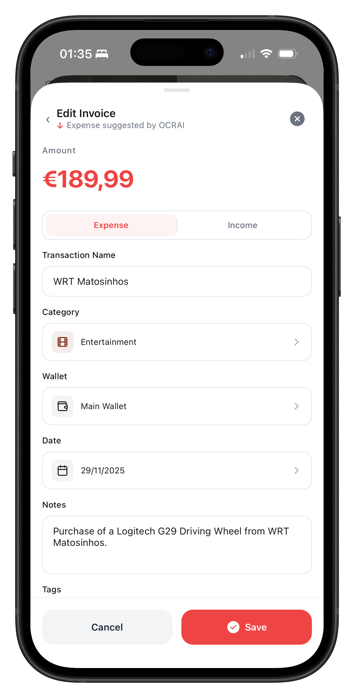
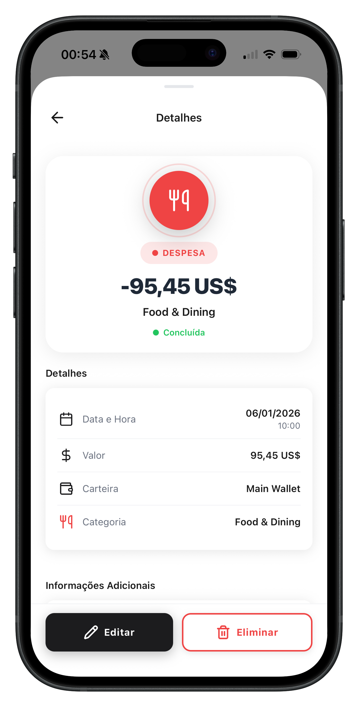
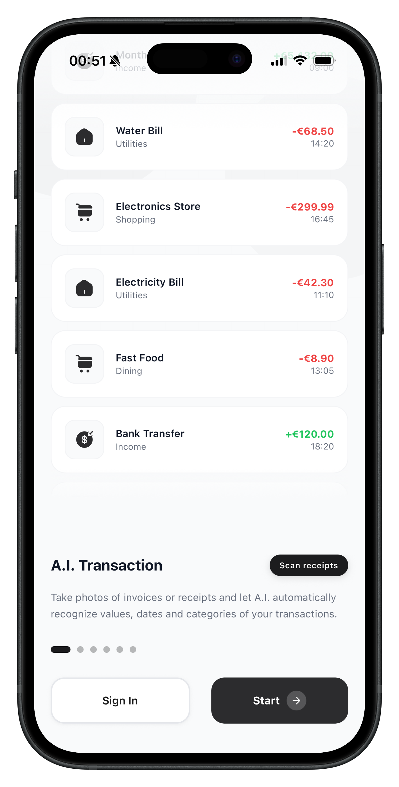

<div align="center">
  
</div>

# WalletHaven

WalletHaven is a comprehensive personal finance management application built with React Native and Node.js. It provides users with an intuitive and powerful way to track expenses, manage multiple wallets, set financial goals, and even use AI-powered receipt scanning to automatically categorize transactions. Whether you're a developer looking for a reference project or someone seeking better financial control, WalletHaven offers a complete solution.

## Features

**AI-Powered Transaction Recognition**: Scan receipts and invoices using your camera, and let AI automatically recognize values, dates, and categories of your transactions.

**Multi-Wallet Management**: Create and manage multiple wallets/accounts with different currencies. Track balances, expenses, and income across all your accounts.

**Transaction Tracking**: Complete transaction history with detailed information including dates, categories, amounts, and descriptions. Search and filter transactions easily.

**Financial Goals**: Set savings goals, track progress, and receive insights to help you achieve your financial objectives.

**Category Management**: Automatic and manual categorization of expenses. Organize your spending by categories like shopping, home, leisure, food, transport, and more.

**Security**: Secure authentication with email and Google Sign-In. PIN and biometric authentication options for app access protection.

**Multi-Currency Support**: Support for multiple currencies worldwide, allowing you to manage finances in your preferred currency.

**Recurring Transactions**: Set up recurring transactions for subscriptions, bills, and regular income.

## Screenshots

| Main Screen | Transactions | Goals | Settings |
|------------|--------------|-------|----------|
|  |  |  |  |

| AI Receipt Scan | Category View | Transaction Detail | Welcome Screen |
|----------------|---------------|-------------------|----------------|
|  |  |  |  |

*For more screenshots, check the [screenshots folder](./screenshots/README.md)*

## Project Structure

This repository contains two main components:

- **wh-app**: React Native mobile application (iOS & Android)
- **wh-api**: Node.js/Express REST API backend

## Usage

### Prerequisites

- Node.js (>= 20)
- React Native development environment set up
- Supabase account (for database and authentication)
- iOS: Xcode and CocoaPods
- Android: Android Studio and Android SDK

### Setup Instructions

1. **Clone this repository to your local machine:**
   ```bash
   git clone https://github.com/MasteerRui/Wallet-Haven.git
   cd Wallet-Haven
   ```

2. **Backend Setup (wh-api):**
   ```bash
   cd wh-api
   npm install
   ```
   
   Create a `.env` file in the `wh-api` directory with the following variables:
   ```env
   PORT=3000
   NODE_ENV=development
   
   # Supabase Configuration
   SUPABASE_URL=your_supabase_url_here
   SUPABASE_KEY=your_supabase_anon_key_here
   SUPABASE_SERVICE_ROLE_KEY=your_supabase_service_key_here
   SUPABASE_STORAGE_BUCKET=main
   
   # OCR AI API Configuration
   OCR_API_KEY=your_tabscanner_api_key_here
   OPENAI_API_KEY=your_openai_api_key_here
   
   # Email Configuration
   SMTP_HOST=smtp.gmail.com
   SMTP_PORT=587
   SMTP_SECURE=false
   SMTP_USER=your_email@example.com
   SMTP_PASSWORD=your_email_password_here
   EMAIL_FROM=your_email@example.com
   
   # App Configuration
   APP_URL=http://localhost:3000
   ```
   
   Start the API server:
   ```bash
   npm start
   ```

3. **Mobile App Setup (wh-app):**
   ```bash
   cd wh-app
   npm install
   ```
   
   **For iOS:**
   ```bash
   cd ios
   pod install
   cd ..
   npm run ios
   ```
   
   **For Android:**
   ```bash
   npm run android
   ```
   
   **Update API Configuration:**
   
   Edit `wh-app/src/constants/config.ts` and update the `BASE_URL` to point to your API server:
   ```typescript
   export const API_CONFIG = {
     BASE_URL: 'http://localhost:3000/api', // For local development
     // Or use your local IP: 'http://192.168.x.x:3000/api'
   };
   ```

4. **Configure Supabase:**
   - Create a new Supabase project
   - Set up the required database tables (users, wallets, transactions, categories, goals, etc.)
   - Configure authentication providers (Email, Google OAuth)

## Technology Stack

**Frontend (Mobile App):**
- React Native 0.82.0
- TypeScript
- React Navigation
- AsyncStorage
- React Native Vision Camera (for receipt scanning)
- React Native Biometrics

**Backend (API):**
- Node.js
- Express.js
- Supabase (Database & Authentication)
- OpenAI API (for AI features)
- TabScanner OCR API
- Nodemailer (for email services)

## Contributing

Contributions are welcome! If you'd like to contribute to this project, please follow these guidelines:

1. Fork the repository.
2. Create a new branch for your feature or bug fix: `git checkout -b feature/your-feature`
3. Make your changes and commit them: `git commit -m "Add your feature or fix"`
4. Push your branch to your forked repository: `git push origin feature/your-feature`
5. Create a pull request to merge your changes into the main repository.

## License

This project is licensed under the MIT License.

## Issues

Enjoy using WalletHaven! If you have any questions or encounter any issues, please feel free to open an issue on GitHub.
